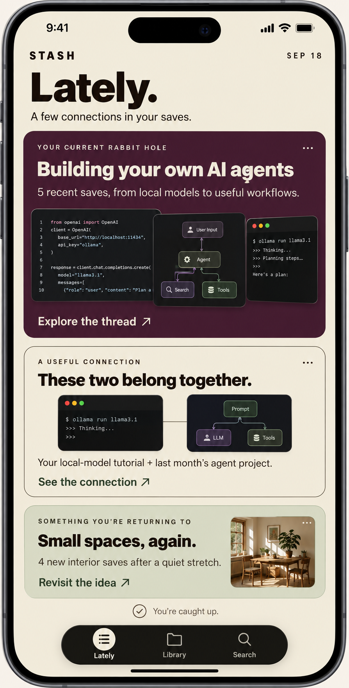

# Lately: a finite digest of connections in your saves

Date: 2026-09-18

Status: Technical proposal for review; implementation has not started.

Scope: Replace the Recents surface with Lately. Preserve Library and the configurable tab shell.

## 1. Product contract

Library answers “Where is that thing I saved?” Lately answers “What is emerging from what I saved?”

Lately presents zero to three evidence-backed cards: a current interest, a recent-to-older connection, and an interest the user has returned to. Each card explains its inclusion and opens its supporting saves. There is no chronological feed, category shelf, random resurfacing, engagement streak, autoplay, or infinite pagination.

Success means a user can understand a relationship before opening a video. Showing fewer cards is preferable to weak or invented relationships. There is no requirement to fill all three slots.

The visual direction below was requested in conversation. Its contents are fictional examples, not verified insights about the user's collection.

The mockup establishes hierarchy, cream/ink styling, a plum hero, outlined connection card, sage returning-interest card, and a finite ending. Its three-tab navigation is illustrative: retain the user's configured tabs and the existing Search entry point. Support scrolling and Dynamic Type rather than forcing every card onto one viewport.

## 2. Current implementation and constraints

- `App/Sources/RecentsView.swift` queries saves by bookmark date, renders a newest-save hero, session threads, loose saves, and one older save. These list-oriented sections will be replaced.
- `TikTokBrainKit/Sources/TikTokBrainKit/RecentsSelector.swift` selects 8–12 recent saves, uses four-hour sessions, and rotates an older save by calendar day. Do not reuse these ranking/rotation rules for Lately.
- `App/Sources/LibraryView.swift` owns intent shelves, import, settings, and items needing classification. Those responsibilities remain there.
- `App/Sources/TikTokBrainApp.swift` stores the Recents tab as `StashTab.today`; saved tab configuration uses its raw value. Keep `today` as the persistence identity, change the label to `Lately`, update the blurb, and route it to the new view. Preserve category ownership and tab reselection behavior.
- `Video` already supplies `videoID`, `bookmarkedAt`, `topics`, `categoryRaw`, title/summary and thumbnail information. App helpers supply `needsLook` and `isArchived`. No viewing history is required or inferred.
- The earlier interest-mining spec documents streaky saving and topic-based opportunities. Its historical dataset findings inform this proposal, but the thresholds below are proposed defaults, not validated quality claims.

## 3. Version-one boundaries

Selection is deterministic and local. No new server endpoints, embeddings, model calls, background notification jobs, or generated prose. Existing analysis provides topics; templates describe only facts supported by topics and dates.

In particular, a shared topic does not prove that a tutorial works with a project. Version one says “Both saves mention local models,” not “This tutorial solves your project.” The mockup's more editorial headlines are direction, not permission to fabricate semantic relationships.

No changes to the `Video` schema are required. Persist digest presentation and dismissals separately, scoped to the signed-in account. Cross-device digest synchronization is out of scope.

## 4. Input and time semantics

The app maps SwiftData records into immutable, Sendable selector inputs. Include only saves that are neither `needsLook` nor archived, have a valid recognized category, a nonempty ID, a bookmark date no later than the supplied clock, and at least one normalized topic. Failed/unclassified saves never become digest evidence.

Deduplicate by `videoID` before counting: prefer the record with the newest bookmark date, then the lexically first canonical encoding of selection fields on a tie. This is a defensive deterministic fallback; normal storage should have unique IDs. Normalize topics by trimming, collapsing whitespace, lowercasing with a fixed locale, and removing empty values. Deduplicate topics within each save. Do not silently merge synonyms or stem terms in v1. Preserve a deterministic original spelling for display.

Use an explicit generic-topic exclusion set for selection: `other`, `general`, `video`, `tiktok`, `fyp`, `viral`, `trending`, `lifestyle`. Version this set alongside the rules. Categories alone never establish a connection.

All algorithmic days are exact 86,400-second intervals in UTC; localized calendar formatting is presentation-only. Inject `now` for tests. Let `A` be the maximum eligible bookmark date. Define recent evidence as dates in `[A − 30 days, A]`. Use every eligible save in that interval; thumbnail limits do not limit evidence counts. This accommodates saving bursts without the old twelve-item cutoff.

If there is no eligible input, there is no digest. If `now − A > 30 days`, the surface is a historical digest: show “From your saves · <date range>,” use “You were exploring” instead of “Your current rabbit hole,” and avoid “recent,” “now,” or “this week.” Old imports are never presented as activity today.

## 5. Candidate rules and ranking

Generate the three candidate types independently, then apply the composition rules. Each candidate includes its kind, canonical topic key, ordered evidence IDs, factual evidence counts/dates, ranking tuple, and content signature. All sorts end with canonical topic and video ID ascending as deterministic tie-breakers.

### 5.1 Current interest

For each allowed topic, collect all recent saves containing it. Qualify at three or more distinct saves. A four-hour session is not required, and all supporting saves must actually contain the topic.

Rank by distinct supporting saves descending, distinct UTC save dates descending, latest supporting date descending, then topic ascending. Display at most three thumbnails; show the full supporting count and period. Suggested template:

> YOUR CURRENT RABBIT HOLE

> AI agents

> 5 saves about AI agents · Sep 6–18

> Explore the thread

The title is the topic display label, not an invented summary of what every video teaches.

### 5.2 Recent-to-older connection

Pair a recent save with an older save whose date is strictly before `A − 30 days`. Require at least two shared allowed topics. For each shared topic, compute document frequency over all eligible saves. At least one shared topic must occur in no more than 20% of eligible saves, preventing ubiquitous labels from driving the match.

Rank pairs by the sum of `1 / documentFrequency(topic)` over shared topics descending, shared-topic count descending, recent date descending, older date descending, then the two IDs ascending. Enumerate pairs using a topic-to-ID index rather than materializing all library pairs.

The card shows two thumbnails, their source titles, and “Both mention <topic 1> and <topic 2>.” Choose the two rarest shared topics, breaking ties lexically. The CTA is “See the connection.” The evidence is a topic match, not a claim that the items are compatible, interchangeable, or a solution to each other.

### 5.3 Returning interest

For each allowed topic, require at least three recent supporting saves and at least two historical supporting saves before the recent interval. Let `R` be its earliest recent save and `P` its latest historical save. Qualify only when `R − P >= 60 days`. Because the recent interval contains every save and `P` is the latest older occurrence, this is an observed gap in saving that topic.

Rank by recent supporting count descending, gap duration descending, latest recent date descending, then topic ascending. Suggested copy: “Back to <topic>” and “4 saves after 72 days without a save on this topic.” For historical digests use “You returned to <topic>.” Never say the user stopped caring about the interest.

Evidence includes all recent matching saves plus the two newest historical matches, clearly separated and dated in the destination. Counts on the face refer only to recent matches.

### 5.4 Composition

Select at most one of each kind. Reserve the highest-ranked returning-interest candidate first, then select the highest-ranked current-interest candidate on a different topic with no shared evidence IDs. This reservation preserves the more specific returning story when it would otherwise also win current interest. Finally choose the highest-ranked connection with no evidence IDs used by the other cards. If no eligible candidate remains for a slot, omit it.

Display order remains current interest, connection, returning interest. Do not enlarge another kind into a fake current-interest hero when that slot is absent. Do not pad empty slots with individual saves. Evidence IDs may not appear on two visible cards.

Thresholds are named constants in `LatelySelector.Rules`, with `rulesVersion = 1`. Changes to thresholds, normalization, templates, or composition that alter digest identity must bump the version and have fixture coverage.

## 6. Stable digest, refresh, and dismissal

Persist a versioned digest snapshot rather than recomputing display order in SwiftUI `body`. The snapshot records the anchor date, generation date, rules version, selected cards and their evidence, and the canonical fingerprint of all selection-relevant input (IDs, dates, category/eligibility, normalized topics). Use a stable digest such as SHA-256 over canonical sorted encoding; never Swift's process-randomized `Hasher` for persisted identity.

On first opening with eligible data, create a digest. Reopening with the same fingerprint reuses it exactly. Time passing alone changes historical/fresh wording but never rotates evidence or order. While a snapshot is published, use its captured anchor for wording and safety revalidation; unseen new saves must not make frozen stories look current or expire their recent interval. A newly accepted snapshot uses its own anchor.

Observe input changes and debounce them for two seconds to avoid rebuilding on each import write. Compute candidate snapshots off the main actor from immutable inputs, cancel superseded work, and reject completions belonging to an old account or input revision. No SwiftData objects cross actors.

On later changes:

1. If the current screen is not visible, accept the recomputed snapshot on next entry.
2. If visible and a nonempty digest exists, keep its valid cards and offer a small “New connections” button when the proposed card signatures differ. Tapping installs the new snapshot atomically; scrolling never causes replacement.
3. If visible and no qualifying digest has ever been published for this state, reveal the first qualifying digest after the debounce without requiring the button. Persist a hasPublishedDigest flag; an all-dismissed digest is not a first-digest state and receives the explicit refresh control instead.
4. Deletion, archival, or reanalysis that invalidates displayed evidence takes priority over stability: immediately remove unsafe evidence and revalidate its card. If its thresholds no longer hold, remove the card. Refresh factual counts/copy for retained cards; never leave a broken link. Offer replacement candidates through the same refresh path.
5. If only titles or thumbnails change, update presentation in place. They are not ranking signals. If the visible signatures remain identical, update validated counts, dates, shared-topic explanations, evidence metadata, and the stored input fingerprint without showing a refresh control; signature equality must not preserve corrected facts. Retain the published anchor until refresh.

A card signature contains the rules version, kind, canonical theme (or canonical pair IDs for a connection), and sorted evidence IDs. Changes to ranking alone do not create a new identity. Store dismissed signatures with their evidence set and dismissal time. “Hide this connection” removes the card from Lately only, with an immediate Undo. It never deletes, archives, or edits saved content.

Dismissal suppression occurs before composition. An identical signature remains suppressed across restarts. Use one theme-dismissal key per normalized topic, shared across current and returning kinds. A theme may reappear only when a proposed qualifying candidate contains at least three recent supporting IDs outside the most recently dismissed evidence set, using the proposed snapshot's recent interval; older historical evidence does not count, while a newly imported save in that interval does count. This is a change in available evidence, not a claim about import time. Until then suppress both kinds for that theme; merely losing evidence, changing a label, or incrementing a rules version must not resurrect it. A connection pair stays suppressed while either ordering represents the same two IDs. Persist semantic dismissal keys separately from versioned signatures to support this behavior.

Do not fill a dismissed slot immediately. Subsequent digest refreshes can fill it with another qualifying candidate. If all cards are dismissed, show “You’re caught up” and “New connections will appear as you save.” Empty candidate results show “No strong connections yet” instead. Neither state sends the user into a new feed.

## 7. Persistence and account lifecycle

Use one small, versioned Codable state document per account in the app's Application Support directory, managed by an app-level `LatelyStore`. Store IDs, normalized evidence, counts/dates, dismissed evidence sets, and snapshot metadata; do not duplicate video media, transcripts, or summaries. Resolve titles and images against live records.

Write atomically. Missing/corrupt/unsupported state falls back to deterministic regeneration; show the digest even if persistence fails, using session-memory state and a diagnostic without sensitive content. Account ID is obtained from the established session boundary, never inferred from save IDs. Encode/hash it into a filesystem-safe filename.

The store must not load one account's state into another account's view. Clear in-memory state and pending computation on sign-out; preserve disk state for same-account return, matching the existing preserved-library behavior. In `TikTokBrainApp.discardForeignLibrary()`, clear the outgoing account's digest alongside its library and finish cleanup before hydrating the incoming digest. On successful account deletion in `ImportView`, clear the deleted owner's disk state: capture the owner ID before awaiting `session.deleteAccount()`, because that call clears authentication. Development resets that erase the library also erase its digest state. Require both the filename scope and envelope owner ID to match `StashSession.userID`; with no authenticated owner, load/generate nothing. No cross-device sync or SwiftData schema migration is introduced.

Extend the hand-maintained account export in `ImportView.writeExport()` with a versioned Lately state section, including dismissals. Export only the current owner's state; media remains outside this document.

## 8. View and navigation contract

`LatelyView` uses `StashScrollView(tab: .today)`, existing background/type/spacing tokens, and `stashTabBarClearance`. Header: STASH, a localized date or historical period, “Lately.”, and “A few connections in your saves.”

Cards use existing thumbnail loading/fallbacks and three distinct visual treatments from the concept. Every card has a visible explanation, an accessible primary action, and a separate ellipsis menu with Hide. Do not put an interactive menu inside a whole-card `NavigationLink`; use separate controls with unambiguous hit targets.

Thread and returning cards open a `LatelyEvidenceView` containing the topic, factual explanation, date interval, and supporting saves. Returning evidence is divided into “Recent saves” and “Before the break,” with historical wording when applicable. Connection cards open an evidence view with the shared topics and exactly two dated source items. Each source routes to the existing `VideoDetailView`.

Evidence screens are scoped to the selected story; they are not replacement Library filters. Their membership is the snapshot's evidence set, minus invalidated records. Live titles/thumbnails may update. If evidence disappears while the destination is open, recompute its explanation and render an honest unavailable state when the story no longer qualifies.

End nonempty digests with “You’re caught up.” It means the finite digest ends here, not that the user has read or watched the videos. No progress tracking is implied.

Accessibility: respect Dynamic Type, permit headline/body wrapping, maintain 44-point control targets, expose readable counts/dates to VoiceOver, and hide decorative overlapping images from duplicate announcements. Meaning cannot rely on color. Reduce Motion disables reveal/reorder animation. Verify both supported color schemes against existing theme behavior.

## 9. State matrix

| Condition | Behavior |
| --- | --- |
| No saved videos | “Your connections start here.” Link to the existing import flow. |
| Saves exist, none are eligible yet | “Your saves are still being organized.” Link to Library for processing/errors. |
| Eligible saves, no qualifying candidates | “No strong connections yet.” Link to Library; no filler cards. |
| One or two candidates | Render only those cards and the finite ending. |
| Last eligible save over 30 days old | Historical header and past-tense templates. |
| All selected stories hidden | Caught-up dismissal state; no immediate replacements. |
| Offline | Local selection/navigation work; use existing thumbnail fallback behavior. |
| Import/reanalysis changes data | Debounced proposal; explicit visible refresh as specified above. |
| Corrupt local digest state | Regenerate from eligible saves; preserve Library. |

Distinguish pipeline processing from terminal errors using existing stage state; if every excluded save has failed, say “No analyzed saves yet” and link to Library/Archive rather than suggesting work is still running.

## 10. Implementation boundaries

| Area | Proposed responsibility |
| --- | --- |
| `TikTokBrainKit/.../LatelySelector.swift` (new) | Pure inputs, normalization, rules, indexed candidates, composition, evidence and deterministic ranking. No SwiftUI, disk, network, or live clock. |
| `TikTokBrainKit/.../LatelyDigestState.swift` (new) | Codable snapshot/dismissal types and pure suppression/refresh decisions. |
| `App/Sources/LatelyStore.swift` (new) | Account-scoped disk state, input observation/debounce, revision cancellation, snapshot lifecycle. |
| `App/Sources/LatelyView.swift` (new) | Header, zero-to-three cards, refresh control, empty states, Hide/Undo. |
| `App/Sources/LatelyEvidenceView.swift` (new) | Evidence destinations and routing to existing video detail. |
| `App/Sources/TikTokBrainApp.swift` | Label/blurb/destination changes; retain `.today` identity and configured tabs. |
| `App/Sources/TikTokBrainApp.swift`, `ImportView.swift` | Account-switch/deletion/reset cleanup and current-account state export; use `StashSession.userID` as owner. |
| `App/Sources/SampleData.swift` | Preview scenarios with intentionally qualifying evidence. |
| `TikTokBrainKit/Tests/TikTokBrainKitTests/` | Selector/state fixtures, deterministic and lifecycle tests. |

Remove the old Recents view/selector/tests only after checking remaining references. Reuse or replace `ThreadListView` deliberately; it currently lives inside the Recents view file. Do not leave two competing Recents/Lately engines wired to the app. Verify source inclusion through the existing XcodeGen/project workflow.

## 11. Verification and acceptance

Automated behavioral coverage:

- Empty, unclassified, archived, duplicate-ID, empty-topic and future-date input.
- Exact 30-day boundaries, three-save thresholds, 60-day returning gap, and 20% document-frequency cutoff.
- Topic normalization and generic-topic rejection; each count is of distinct saves, not tags.
- Current-interest evidence can span sessions; related topics without exact overlap do not silently merge.
- Connection requires two shared allowed topics and at least one sufficiently rare topic.
- Returning interest requires older evidence and a real gap; continuously saved topics do not qualify.
- Reordered input yields identical output, including tie cases; no repeated evidence across cards.
- Historical imports receive historical language; clock advancement does not rotate the digest.
- Restart preserves cards/dismissals; Hide/Undo, new-evidence threshold and unchanged-pair suppression work.
- Reanalysis/removal invalidates evidence safely; no out-of-date asynchronous result replaces newer state.
- Account switching, sign-out/reset, corrupt state and write failure have isolated recoverable behavior.

Use an injected clock and explicit fixtures; do not depend on a developer's personal dataset for CI. During implementation run `swift test --package-path /Users/dmitryschab/Documents/projects/stash_app/TikTokBrainKit`, `xcodebuild -project /Users/dmitryschab/Documents/projects/stash_app/App/Stash.xcodeproj -scheme Stash -sdk iphonesimulator -destination 'generic/platform=iOS Simulator' CODE_SIGNING_ALLOWED=NO build` (generate the project with the existing XcodeGen configuration if required), and simulator verification of navigation, configured tabs, offline images, Dynamic Type, VoiceOver, and Reduce Motion. Resolve the simulator destination from installed runtimes instead of hard-coding an unavailable device.

Quality review before enabling: inspect candidate output against the available seed library and deliberately sparse fixtures. Record how many cards qualify and why; verify explanations manually. If exact-topic rules produce few good connections, ship fewer cards. Do not loosen thresholds merely to match the three-card illustration.

Performance target: measure selection on a 10,000-save fixture with up to five topics per save; aim for under 100 ms excluding I/O on the selected reference simulator/device, and record the environment. This is a proposed target, not a measured result. Keep selection off the main actor and guard against common-topic pair explosions via the rarity filter/index.

Release acceptance: users can distinguish every Lately card from a Library shelf by its visible relationship/explanation; every claim can be reconstructed from its evidence; cards remain stable without meaningful input changes; no tab preferences or saved content are lost.

## 12. Delivery sequence and deferred work

1. Implement the pure selector and fixture coverage; inspect real-data candidate quality.
2. Implement the state/store lifecycle, suppression, refresh, and cleanup tests.
3. Build cards/evidence screens and integrate the existing tab identity.
4. Verify accessibility, account lifecycle, import behavior and performance; remove obsolete Recents code.

Defer semantic/LLM summaries, synonym clustering, viewed/unviewed claims, task recommendations, external content, and synchronized personalization. Each needs separate evidence and product scope. This document is the design specification, not an authorization to implement or deploy.
